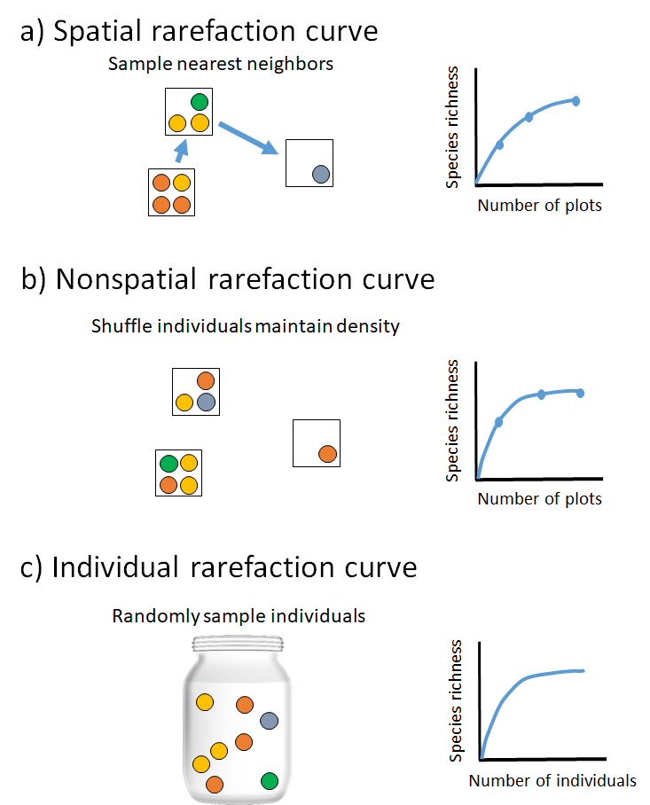
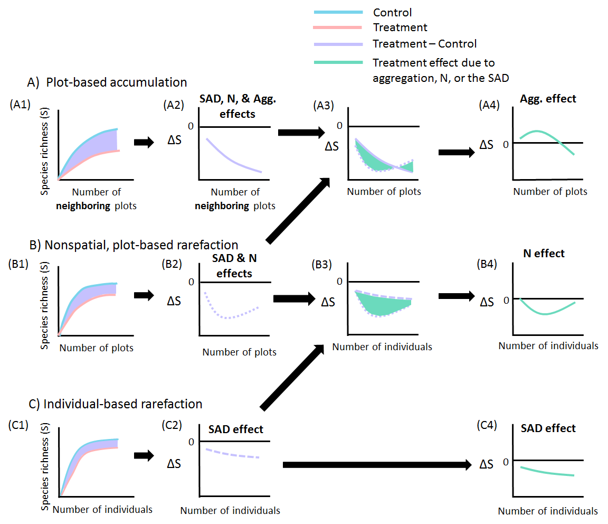

# Installing `mobr`

The package `mobr` is currently available on GitHub and you can freely download 
the source code here [mobr on GitHub](https://github.com/MoBiodiv/mobr)

The easiest option is to install the package directly from GitHub using the package `devtools`. If you do not already have `devtools` installed then need to install it.

```{r install package, eval = F}
install.packages('devtools')
library(devtools)
install_github('MoBiodiv/mobr')
```

If you receive an error we would love to receive your bug report 
[here](https://github.com/MoBiodiv/mobr/issues)

# Data structure required by `mobr`

To work with `mobr` you need two matrix-like data tables:

1. Species abundance data in a community matrix (rows are sites and columns are species)

2. A site attributes table (rows are sites and columns are site attributes)

The community matrix must include the number of individuals of each species.

The table with the plot attributes should include spatial coordinates
of plots and information on experimental treatments and/or environmental variables.
By default spatial coordinates are assumed to be named "x" and "y" for the easting and
northing respectively unless otherwise specified by the argument `coord_names`. 
If the supplied coordinates are latitudes and longitudes be sure to set the 
argument `latlong = TRUE` which turns on great circle distances rather than 
Euclidean distances when computing the spatial, sample-based rarefaction (sSBR). 
If temporal trends are of interest rather than simply only supply one coordinate
which represents time. 

# Invasion case study

We will examine a case study on the effects of an
invasive plant _Lonicera maackii_ on understory plant biodiversity in a Missouri
woodland (Powell et al. 2003). This data was reanalyzed in McGlinn et al. (2018).

This data set is included in `mobr`and available after loading the library

```{r load pkg and data, message=FALSE}
library(mobr)
data(inv_comm)      # Community matrix
data(inv_plot_attr) # Plot attributes data.frame
```

```{r examine data}
str(inv_comm)
head(inv_plot_attr)
```

The plot attributes include the information if a plot is located in invaded or
uninvaded sites as well as the spatial xy coordinates of a plot.

## Preparing data

In order to analyze the data with `mobr` the two data tables have to be combined
into on single object

```{r make mob_in}
inv_mob_in <- make_mob_in(inv_comm, inv_plot_attr)
inv_mob_in
```

# Exploratory data analysis

The package `mobr` offers functions for exploratory data analysis and visualization.

First let's look at the spatial, sample-based rarefaction (sSBR) in which samples are
added depending on their spatial proximity. 

```{r, fig.width = 5, fig.height = 5}
plot_rarefaction(inv_mob_in, 'group', 'spat', lwd=4)
```

We can see that invasion decreases richness and that the magnitude of the effect
depends on scale. Let's dig in further to see if we can better understand
exactly what components of the community are changing due to invasion.

First we look at the individual rarefaction curves for each treatment which
only reflect the shape of the SAD (i.e., no individual density or aggregation effects):

```{r, fig.width = 7, fig.height=4}
par(mfrow=c(1,2))
plot_rarefaction(inv_mob_in, 'group', 'indiv', pooled=F, lwd=2,
                 leg_loc='topright')
plot_rarefaction(inv_mob_in, 'group', 'indiv', pooled=T, lwd=4,
                 leg_loc=NA)
```

Visually you can see there are some big differences in total numbers individuals
(i.e., how far on the x-axis the curves go). We can also see that for small 
numbers of individuals the invaded sites are actually more diverse! This is 
a bit surprising and it implies that the invaded sites have greater evenness. 
We can directly examine the species abundance distribution (SAD):

```{r, fig.width = 7, fig.height=4}
par(mfrow=c(1,2))
plot_abu(inv_mob_in, 'group', type='rad', pooled=F, log='x')
plot_abu(inv_mob_in, 'group', type='rad', pooled=T, log='x')
```

The SADs suggest that the invaded site has greater evenness in its common
species (i.e., flatter left hand-side of rank curve).

# Two-scale analysis

There are a myriad of biodiversity indices. We have attempted to chose a subset
of metrics that can all be derived from the individual rarefaction curve which
capture the aspects of biodiversity we are most interested in, namely:

1. Numbers of individuals (i.e., density effects)
2. The distribution of rarity and commonness (i.e., the SAD)
3. The spatial patchiness or aggregation of conspecifics.

The metrics we have selected are:

* **N - Number of individuals**
* **S - Observed species richness**
* **S_n - Rarefied species richness (Hurlbert 1971)**
* **PIE - Probability of Interspecific Encounter (Hurlbert 1971)**
* **S_PIE - Effective number of species based on PIE (Jost 2007)**

Each of these metrics can be computed for either the sample or group scale individual rarefaction curves as shown in the figure below: 

<center>{ width=50%}</center>

The ratio of a given biodiversity metric at the group and sample scales
(i.e., $\beta_S = S_{group} / S_{sample}$ can provide simple measures of
species turnover or \(\beta\)-diversity. Depending on which metric the 
\(\beta\)-diversity is derived from will determine what aspects of species
turnover it is most sensitive too (McGlinn et al. 2018, Chase et al. 2018).


```{r run two-scale analysis, eval = FALSE}
inv_stats <- get_mob_stats(inv_mob_in, group_var = "group", 
                           n_perm = 200)
```

```{r, echo = FALSE}
load('../vignettes/inv_stats.Rdata')
```

We can examine the `inv_stats` object 

```{r}
names(inv_stats)
```

There are also functions for plotting the indices at the sample and group levels.
First let's examine species richness:

```{r, fig.width = 7, fig.height = 3.5}
plot(inv_stats, 'S')
```

Invasion appears to decrease local sample diversity but not gamma diversity.
Somewhat surprisingly it appears to increase \(\beta\)diversity. 

One of the major effects we observed in the individual rarefaction curve was 
that the invaded sites appeared to have fewer individuals, let's examine the 
test of that:

```{r, fig.width = 7, fig.height = 3.5}
plot(inv_stats, 'N')
```

Clearly our intuition was correct there is a very strong negative effect of 
invasion on N. So it appears that the changes we observed in S may be due to 
the negative effect of invasion on N. Let's examine `S_n` to test this:

```{r, fig.width = 7, fig.height = 3.5}
plot(inv_stats, 'S_n')
```

```{r, fig.width = 7, fig.height = 3.5}
plot(inv_stats, 'S_PIE')
```

We can also plot `f_0` but for this dataset this metric
does not show strong patterns so we'll stop here for now. If you 
want to plot all the biodiversity metrics at once you can simply use:

```{r, eval=FALSE}
plot(inv_stats)
```

# Multi-scale analysis

The continuous scale analysis using `mobr` aims at disentangling the 
consequences of three biodiversity components on observed changes in species
richness

1. **Species abundance distribution (SAD)**
2. **Number of individuals (N)**
3. **Aggregation (clumping) of conspecific individuals**

To accomplish this we use three different rarefaction curves which each 
capture different aspects of community structure:

<center>{ width=50%}</center>

If we examine the difference between each of these curves in our two treatments
we can learn how the treatment influences richness via its effects on 
different components of community structure.

<center>{ width=75%}</center>

We can carry out this analysis in `mobr` using the function `get_delta_stats`.
For the sake of speed we'll run the analysis with just 20 permutations but 
at least 200 are recommended for actual applications. 

```{r multi-scale analysis, eval=FALSE}
inv_deltaS = get_delta_stats(inv_mob_in, 'group', ref_group='uninvaded',
                             type='discrete', log_scale=TRUE, n_perm = 199)
```

```{r, echo=FALSE}
load('../vignettes/inv_deltaS.Rdata')
```

The best way to examine the contents of this object is to plot it. 
First let's examine the three rarefaction curves:

```{r, fig.width=7, fig.height=3.5}
plot(inv_deltaS, 'invaded', 'uninvaded', display='rarefaction')
```

Now let's consider the differences between each set of curves:

```{r, fig.width=7, fig.height=3.5}
plot(inv_deltaS, 'invaded', 'uninvaded', display='delta S')
```

Lastly, we can isolate the individual effects of each component by taking one
more difference between the curves:

```{r, fig.width=7, fig.height=3.5}
plot(inv_deltaS, 'invaded', 'uninvaded', display='ddelta S')
```

The grey polygons above represent the 95% quantile for the null models of
no treatment effect. 

Let's examine these individual effects across in a way that is easier to compare
their effects using the function `overlap_effects`

```{r, fig.width=7, fig.height=4}
par(mfrow=c(1,2))
overlap_effects(inv_deltaS, 'invaded', display='raw', leg_loc = 'bottomleft')
overlap_effects(inv_deltaS, 'invaded', display='stacked', prop=T, leg_loc = NA)
```

# Herbaceous woodland plants response to fire

Meyers et al. (2015) collected data on woody plants in the Missouri Ozarks. They
collected 26 sites that had been recently burned and 26 sites that they considered unburned. We will reanalyze their data using the MoB framework. 

```{r load fire data}
# plant community in response to a prescribed fire treatment in a
# central US woodland
data(fire_comm)
data(fire_plot_attr)
fire_mob_in = make_mob_in(fire_comm, fire_plot_attr)
```

Now that the data is loaded and we have created a `mob_in` object we can begin
visualizing the patterns in the dataset. It is always important to graph any 
dataset before attempting to analyze its patterns. We will start our exploration
with the sSBR.

```{r}
plot_rarefaction(fire_mob_in, 'group', 'spat')
```

The sSBR indicates that the unburned site has higher species richness across
all scales and it appears that the two sites differ in the rate of diversity 
accumulation at certain scales. Let's examine the species-abundance distributions
to see if they may have shifted and may be partially responsible for this 
observed shift in S.

```{r}
par(mfrow=c(1,2))
plot_abu(fire_mob_in, 'group', 'rad', leg_loc = 'topright',)
plot_abu(fire_mob_in, 'group', 'sad', leg_loc = NA)
```

Above we plot the SAD in two different ways. The plot on the left is the standard rank curve and the plot on the right is the cumulative curve which McGill (2011) advocates for using. The cumulative curve makes it particularly
clear that the shape (i.e., eveness) between the treatments is really similar, 
but in the rank curve it does appear that the burned site does some sites that 
are highly dominated by a single species. 

Let's use the two-scale analysis to continue this exploration of the data and to 
test some hypotheses regarding which components are driving this decrease in S
in the burned sites. 

```{r, eval = FALSE}
fire_stats = get_mob_stats(fire_mob_in, 'group')
```
```{r, echo = FALSE}
load('../vignettes/fire_stats.Rdata')
```

```{r, fig.width = 7, fig.height = 3.5}
plot(fire_stats)
```

It is clear that the fire decreased abundance of woody plants - that is likely
not a surprise. The question remains if this drove the decreases in *S* we
observed in the sSBR and which are obvious in the second set of panels on *S*.
It is worth noting that that the decrease in *S* is only significant at the
\(\alpha\)-scale, and that fire actually increases \(\beta\)-diversity. When we
examine the pattern of *S<sub>n</sub>* we see that the effect size is half of
what it was for *S* at the \(\alpha\)-scale. indicating that the decrease in *N*
is helping to decrease *S*. Also the significant increase in \(\beta_S\) is not
as strong in \(\beta_{Sn}\) which indicates: 1) that the burned sites have
higher turnover in part because they have fewer individuals, and 2) that there
is a detectable increase in intra-specific aggregation in the burned sites
because \(\beta_{Sn}\) is still higher in the burned site. *S*<sub>PIE</sub>
indicates that their is a shift towards higher eveness in the unburned sites
that is stronger at the \(\gamma\)-scale. So from the two-scale analysis we can
conclude that fire: 1) decreases *N* which decreases *S*, 2) increases
aggregation, and 3) decreases evenness.

Let's now look at the multi-scale analysis to examine the scale-dependence and
relative strength of these effects. 

```{r, eval = FALSE}
fire_deltaS = get_delta_stats(fire_mob_in, 'group', ref_group = 'unburned')
```
```{r, echo = FALSE}
load('../vignettes/fire_deltaS.Rdata')
```

We'll start just by examining the rarefaction curves. 

```{r, fig.width = 7, fig.height = 3.5}
plot(fire_deltaS, 'burned', 'unburned', display = 'rarefaction')
```

These confirm our expectations based on the two-scale analysis. The IBR indicates
the increase in evenness in the unburned site particularly at coarse scales, the
nsSBR illustrates that the N-effect is fairly strong, and the sSBR shows that their
are some effects of aggregation. The delta effect curves can show this more clearly:

```{r, fig.width = 7, fig.height = 3.5}
plot(fire_deltaS, 'burned', 'unburned', display = 'ddelta S')
```

These plots illustrate that 1) none of these individual effects are of a really
large magnitude ((\(\Delta\)*S* is never more or less than 2 species), 2) the
*N*-effect is the largest driver of decreases in *S*, 3) the increased
aggregation in the burned sites is only really relevant at fine spatial scales,
and lastly 4) although evenness is lower in the burned sites it is only outside
of the acceptance intervals at the finest spatial scales.

```{r, fig.width=5, fig.height=5}
overlap_effects(fire_deltaS, 'burned')
```


# Enrichment effect on aquatic experimental cattle tank communities

Here we reanalyze data from Chase (2010) in which freshwater aquatic communities of macroinvertebrates and juvenile amphibians in artificial pools (i.e., cattle tanks) were enriched with phosphorus or not. 

```{r}
data(tank_comm)
data(tank_plot_attr)
tank_mob_in = make_mob_in(tank_comm, tank_plot_attr)
```

The data is loaded let's examine the sSBR. 

```{r, fig.width = 5, fig.height = 5}
plot_rarefaction(tank_mob_in, 'group', 'spat')
```

Clearly enrichment had a big effect on species richness as it is larger in the "high" productivity (i.e., enriched) community compared to the "low" community
at all scales. It is rare to see such a strong asympote on a rarefaction curve but it does appear that no new species were being encountered in the low community.

```{r, fig.width = 7, fig.height=4}
par(mfrow=c(1,2))
plot_abu(tank_mob_in, 'group', 'rad')
plot_abu(tank_mob_in, 'group', 'sad', leg_loc = NA)
```

The SAD plots indicate only a modest shift in the evenness component of the SAD
although clearly from the sSBR we know that the size of the species pool is larger
in the high community. 

```{r, eval = FALSE}
tank_stats = get_mob_stats(tank_mob_in, 'group')
```
```{r, echo = FALSE}
load('../vignettes/tank_stats.Rdata')
```

```{r, fig.width = 7, fig.height = 3.5}
plot(tank_stats)
```

The two-scale analysis indicates that enrichment does not affect *N* but that it
does increase *S* but only at the coarse scale. The higher productivity sites
had higher \(\beta_S\) indicating that species turnover was higher due to
enrichment. The analysis of *S*<sub>*n*</sub> indicated that this increase in
turnover was due in part to an increase in spatial aggregation in the enriched
tanks. *S*<sub>PIE</sub> indicated that the pattern of evenness particularly in
common species was not changed by enrichment (as we observed in the plots of the
SADs).

```{r, eval = FALSE}
tank_deltaS = get_delta_stats(tank_mob_in, 'group', ref_group = 'low',
                              inds = 10, log_scale = TRUE) 
```
```{r, echo = FALSE}
load('../vignettes/tank_deltaS.Rdata')
```
```{r, fig.width = 7, fig.height = 3.5}
plot(tank_deltaS, 'high', 'low', display = 'ddelta S')
```

The delta S plot indicates that enrichment increased intra-specific aggregation
which resulted in decreased S, did not influence S via N, and did increase the
size of the species pool which our framework identifies as an SAD effect. We know
from our other analyses that this was not due to large changes in evenness. 

This example is particularly interesting because: 1) there is absolutely no 
density effect, 2) the aggregation effects and SAD effects cancel each other 
out so strongly that a standard analysis of plot *S* indicates no change due to 
enrichment when obviously there are large changes to the community influencing 
richness. 


```{r fig.width = 5, fig.height = 5}
overlap_effects(tank_deltaS, 'high', leg_loc = 'bottomright')
```

# References

Chase, J. M. (2010). Stochastic community assembly causes higher biodiversity in more productive environments. Science, 328: 1388-1391.

Chiu, C.-H., Wang, Y.-T., Walther, B.A. & Chao, A. (2014). An improved nonparametric lower bound of species richness via a modified good-turing frequency formula. Biometrics, 70, 671-682.

Gotelli, N.J. & Colwell, R.K. (2001). Quantifying biodiversity: procedures and pitfalls in the measurement and comparison of species richness. Ecology letters, 4, 379–391

Hurlbert, S.H. (1971). The Nonconcept of Species Diversity: A Critique and Alternative Parameters. Ecology, 52, 577–586

Jost, L. (2007). Partitioning Diversity into Independent Alpha and Beta Components. Ecology, 88, 2427-2439.

Myers, J. A., Chase, J. M., Crandall, R. M., & Jiménez, I. (2015). Disturbance alters beta‐diversity but not the relative importance of community assembly mechanisms. Journal of Ecology, 103(5), 1291-1299.

McGlinn, D. J., Xiao, X., May, F., Gotelli, N. J., Blowes, S., Knight, T., … McGill, B. (2018). MoB (Measurement of Biodiversity): a method to separate the scale-dependent effects of species abundance distribution, density, and aggregation on diversity change. BioRxiv, 244103. doi:10.1101/244103

Powell, K.I., Chase, J.M. & Knight, T.M. (2013). Invasive Plants Have Scale-Dependent Effects on Diversity by Altering Species-Area Relationships. Science, 339, 316–318.
